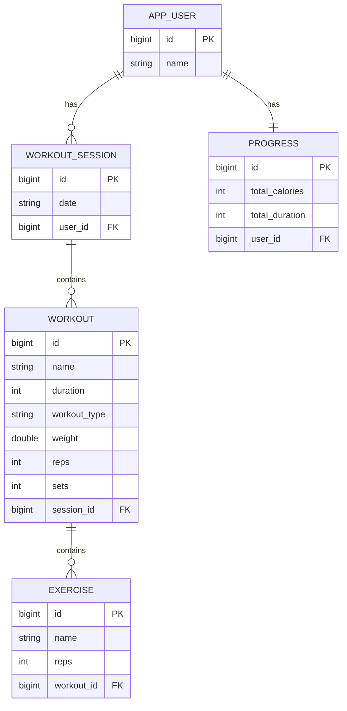

# Workout Tracker

A web application for logging workout sessions (cardio and strength), tracking calories burned, managing multiple users, and automatically monitoring each user's progress. Built as a case study demonstrating Object-Oriented Programming (OOP) concepts in a real application using Java and Spring Boot.

## Features

- Interactive dashboard with summary statistics (total sessions, workouts, minutes, calories, users) and a calorie trend chart
- Dynamic form for adding workouts, with fields adjusting automatically based on the Cardio or Strength type
- User management and assignment of workout sessions to a specific user
- Automatic progress calculation (total calories and duration) for each user
- Exercise logging (specific movements with rep counts) within each workout
- Search and filter workouts by name or type

## OOP Concepts Applied

| Concept | Implementation |
|---|---|
| Inheritance | `CardioWorkout` and `StrengthWorkout` inherit from `Workout` |
| Polymorphism | `calculateCalories()` is overridden differently in each subclass, called uniformly through a `Workout` reference |
| Encapsulation | All attributes are private, accessed through getters and setters |
| Association | `User` has many `WorkoutSession`, which has many `Workout`, which has many `Exercise` |

## Tech Stack

- Backend: Java 17, Spring Boot 3.5, Spring Data JPA (Hibernate)
- Frontend: Thymeleaf, Bootstrap 5, Chart.js
- Database: PostgreSQL (production), H2 in-memory (development)
- Deployment: Railway

## Class Structure

```
Workout (parent)
├── CardioWorkout   : duration, calculateCalories() = duration x 8
└── StrengthWorkout : weight, reps, sets, calculateCalories() = weight x reps x sets x 0.05

WorkoutSession : contains many Workout
Workout        : contains many Exercise
User           : contains many WorkoutSession, has one Progress
Progress       : totalCalories and totalDuration, calculated from all WorkoutSession belonging to a User
```

## Database Structure

| Table | Description |
|---|---|
| workout | Stores both CardioWorkout and StrengthWorkout in a single table, distinguished by the workout_type column |
| workout_session | A workout session, containing a date and a list of workouts |
| app_user | User data |
| progress | Summary of total calories and duration per user |
| exercise | A specific movement within a workout |

Relationships between tables use direct foreign keys (e.g. session_id on the workout table), without hidden join tables.



## Endpoints / Routing

This application uses a server-side rendering pattern (Spring MVC with Thymeleaf) rather than a pure JSON-based REST API each endpoint processes an HTML form and returns a rendered web page (via redirect), not a JSON response.

| Method | Path | Description |
|---|---|---|
| GET | `/` | Displays the dashboard with all sessions, users, and progress data |
| POST | `/add` | Adds a new workout session along with a single workout inside it |
| GET | `/delete-session/{id}` | Deletes a workout session and all workouts within it |
| POST | `/add-user` | Adds a new user |
| POST | `/generate-progress` | Recalculates and saves progress (total calories and duration) for a specific user |
| POST | `/add-exercise` | Adds an exercise to a specific workout |

The form parameters accepted by each POST endpoint can be found in `WorkoutController.java`.

## Environment Variables

The following environment variables are used when the application runs under the production profile (`application-prod.properties`), set via the hosting platform's environment variable settings (Railway):

| Variable | Description |
|---|---|
| `SPRING_PROFILES_ACTIVE` | Set to `prod` so the application uses the PostgreSQL configuration instead of H2 |
| `PGHOST` | PostgreSQL database host |
| `PGPORT` | PostgreSQL database port |
| `PGDATABASE` | PostgreSQL database name |
| `PGUSER` | PostgreSQL database username |
| `PGPASSWORD` | PostgreSQL database password |
| `PORT` | Port the application listens on, automatically set by the hosting platform (defaults to 8080 if not set) |

When run locally without these environment variables, the application automatically falls back to `application.properties` (H2 in-memory), so no additional configuration is required.

## Running Locally

Prerequisites: Java 17 or newer, and Maven (or use the included mvnw wrapper).

```
./mvnw spring-boot:run
```

The application runs at `http://localhost:8080`, using the H2 in-memory database (data resets on every restart — suitable for development).

The H2 database console is available at `http://localhost:8080/h2-console` using the credentials from `application.properties`.

## Deployment

This project is configured for deployment to Railway (https://railway.com) with PostgreSQL as the production database.

1. Push this repository to GitHub
2. Deploy from Railway using the Deploy from GitHub repo option
3. Add a PostgreSQL service to the same Railway project
4. Set the environment variables on the application service according to the Environment Variables table above

The production configuration is located at `src/main/resources/application-prod.properties`.

## Project Structure

```
src/main/java/com/example/workouttracker/
├── controller/   : WorkoutController, handles HTTP requests
├── model/        : JPA entities (Workout, CardioWorkout, StrengthWorkout,
│                   WorkoutSession, User, Progress, Exercise)
├── repository/   : Spring Data JPA interfaces for each entity
└── service/      : Business logic for each entity

src/main/resources/
├── templates/                   : index.html (Thymeleaf)
├── application.properties       : local configuration (H2)
└── application-prod.properties  : production configuration (PostgreSQL)
```

## License

This project was built for an academic assignment in an Object-Oriented Programming course.
